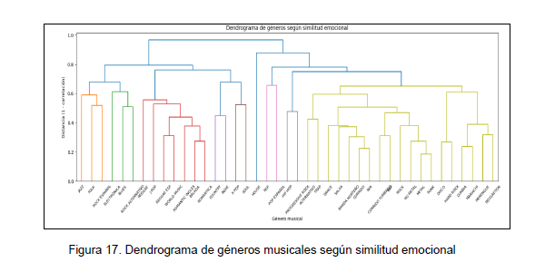
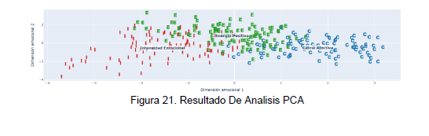
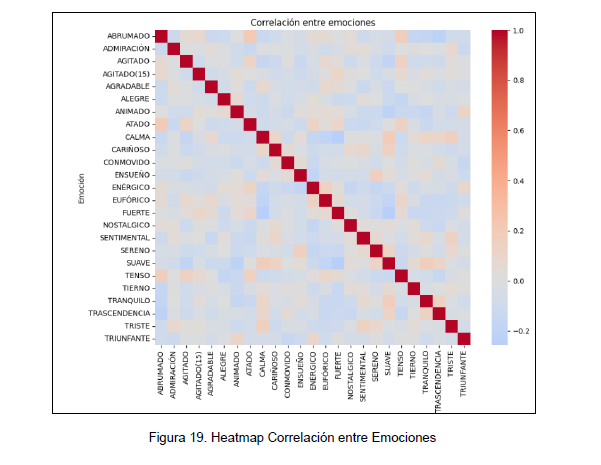
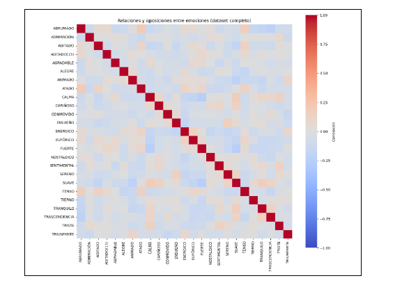
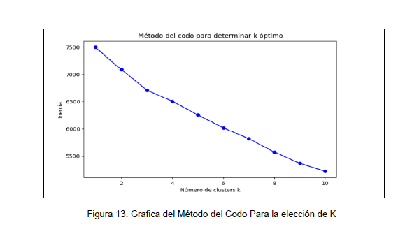

# 📊 Hallazgos del Análisis
## Análisis de Clasificación No Supervisada de Composiciones Musicales
**Proyecto Terminal — Daniel Arellano Morales | UAM Cuajimalpa 2025**

---

> Este documento presenta los 15 hallazgos principales obtenidos a partir del análisis de clustering K-Means, PCA, dendrogramas y heatmaps aplicados sobre las respuestas emocionales de 30 participantes ante 280 composiciones musicales, evaluadas con la escala GEMS-25.

---

## 🎯 Hallazgo 1 — Tres perfiles emocionales universales

El algoritmo K-Means (k=3) identificó tres clústeres bien diferenciados que organizan la experiencia emocional musical en tres grandes dimensiones afectivas, independientemente del género musical de origen.

| Clúster | Nombre | Emociones dominantes |
|---------|--------|----------------------|
| **E** | Energía Positiva | Alegre, Animado, Enérgico, Sereno, Trascendencia |
| **C** | Calma Afectiva | Suave, Calma, Ensueño, Tranquilo, Cariñoso |
| **I** | Intensidad Emocional | Fuerte, Eufórico, Abrumado, Agitado, Conmovido |

---

## 🎯 Hallazgo 2 — El género musical no determina la emoción

El dendrograma de géneros musicales evidencia que estilos tradicionalmente distintos como Jazz y Folk, o Blues y Country, comparten perfiles emocionales similares. Esto demuestra que la clasificación musical tradicional no predice de manera estricta la experiencia emocional del oyente.

---

## 🎯 Hallazgo 3 — Los géneros latinos comparten ADN emocional

Salsa, Cumbia, Merengue y Reggaetón se agrupan en una misma rama del dendrograma de géneros, indicando que a pesar de sus diferencias rítmicas y culturales, evocan respuestas emocionales muy similares en los participantes, predominantemente asociadas a energía y animación.

---

## 🎯 Hallazgo 4 — Rock, Metal, Punk y Hard Rock dominan la Intensidad Emocional

Estos géneros se agrupan consistentemente en el clúster de Intensidad Emocional, caracterizado por emociones como Fuerte, Eufórico y Abrumado. Son los únicos géneros que dominan este perfil de alta activación y carga afectiva intensa.

---

## 🎯 Hallazgo 5 — Pop, Hip-Hop y Dance son emocionalmente intercambiables

El heatmap de similitud emocional entre géneros muestra correlaciones muy altas entre Pop, Pop en español, Hip-Hop y Dance. Esto significa que un oyente percibe emociones prácticamente idénticas entre ellos, cuestionando su separación como categorías musicales distintas desde una perspectiva afectiva.

---

## 🎯 Hallazgo 6 — Dos dimensiones explican toda la estructura emocional

El PCA redujo las 25 emociones de la escala GEMS-25 a 2 componentes principales que capturan la mayor parte de la varianza del espacio emocional. PC1 refleja un gradiente de activación (intenso ↔ calmado) y PC2 refleja la valencia emocional (positivo ↔ sombrío), replicando el modelo clásico Arousal-Valence con datos reales de estudiantes mexicanos.

---

## 🎯 Hallazgo 7 — Las emociones de alta activación forman un grupo coherente

El dendrograma de emociones agrupa Alegre, Animado, Enérgico, Eufórico y Triunfante en una misma rama jerárquica. Esto confirma que el oyente experimenta estas emociones de forma simultánea y correlacionada, no como estados independientes.

---

## 🎯 Hallazgo 8 — Las emociones de calma forman otro grupo coherente

Tranquilo, Sereno, Suave y Calma se agrupan juntas en el dendrograma de emociones, conformando el núcleo del clúster de Calma Afectiva y oponiéndose estructuralmente al grupo de alta activación, lo que refuerza la existencia de un eje activación-relajación en la percepción musical.

---

## 🎯 Hallazgo 9 — Las emociones introspectivas van siempre juntas

Nostálgico, Sentimental, Triste y Conmovido aparecen agrupadas, sugiriendo que la música evoca simultáneamente estos estados reflexivos. El oyente no distingue claramente entre tristeza, nostalgia y sentimentalismo al escuchar música.

---

## 🎯 Hallazgo 10 — Las experiencias emocionales musicales son mixtas, no opuestas

El heatmap de correlación entre emociones muestra relaciones predominantemente moderadas o positivas, con ausencia de correlaciones negativas fuertes. Esto indica que la música evoca experiencias emocionales complejas y mezcladas, no estados emocionales puros y opuestos.

---

## 🎯 Hallazgo 11 — Pop en español es el género más escuchado entre los estudiantes

La encuesta aplicada a 31 estudiantes de LTSI reveló que Pop en Español (17), Reggaetón (15) y Rap en Español (14) son los géneros dominantes, lo que justifica su inclusión como estímulos representativos y explica su peso en el análisis emocional.

---

## 🎯 Hallazgo 12 — Pop inglés lidera sobre todos los géneros en inglés

Con 18 menciones, Pop inglés supera a Rock (17) y Electrónica (16) entre los géneros en inglés más escuchados. Esto muestra una preferencia clara hacia géneros de alta energía positiva, coherente con su predominancia en el clúster de Energía Positiva.

---

## 🎯 Hallazgo 13 — k=3 es el número óptimo de clústeres

El método del codo muestra una reducción significativa de inercia al pasar de k=2 a k=3, mientras que k=4 en adelante ofrece mejoras marginales. Esto valida que 3 perfiles emocionales son suficientes para capturar la estructura real de los datos sin sobreajuste.

---

## 🎯 Hallazgo 14 — Metal y Balada son los géneros emocionalmente más opuestos

El heatmap de similitud emocional entre géneros muestra la correlación más baja precisamente entre Metal y Balada, con valores azulados intensos. Estos dos géneros representan los extremos opuestos del espacio emocional musical: alta intensidad vs. calma sentimental.

---

## 🎯 Hallazgo 15 — La interfaz interactiva valida perceptualmente los clústeres

Al reproducir los fragmentos de audio en el mapa 2D interactivo, los oyentes pueden confirmar auditivamente que las canciones del mismo clúster suenan emocionalmente similares. Esto conecta el modelo matemático con la experiencia auditiva real, aportando una validación perceptual que va más allá de los números.

---

## 📌 Conclusión General

Los hallazgos demuestran que es posible clasificar composiciones musicales de manera significativa a partir de la percepción emocional de los oyentes, sin depender de características acústicas ni etiquetas de género. La combinación de K-Means y PCA revela una estructura emocional latente organizada en tres perfiles afectivos — Energía Positiva, Calma Afectiva e Intensidad Emocional — que trascienden fronteras culturales y de género musical, abriendo nuevas posibilidades para sistemas de recomendación musical basados en emociones.

---

*Arellano Morales, D. (2025). Proyecto Terminal, LTSI — UAM Cuajimalpa.*
